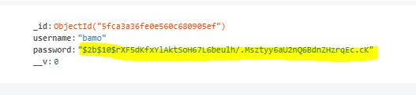
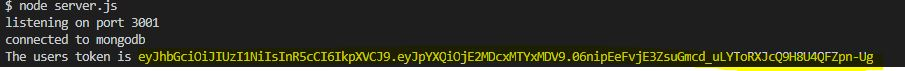

# Node_Jwt

<h1>Register and Login Page using Json Web token </h1>

Initialize a new project with npm init -y and install all the modules you would need (i.e Express, bodyparser)

<h1>Register page functionality </h1>

Send the username and password values to the server, and then store them in a local mongodb database
Used bcyrpt to hash the password on save.

<h1>Login Functionality </h1>

Make a POST request to the server with the username and passowrd values

On the server, we recieve the values and then find the user using the username in the mongodb database
if the user was not found an error message is returned.

If the user was found, we use the <b>brcypt.compare</b> function to compare the password submitted with the hashed password of the user that was found,

After that, we initilaize a jwt for that particular user and send the token back to the client

This token is sent with the particular client and is used for authenthication

The JWT_SECRET was stored in an environmnet variable so it is not accessible to anyone who can see the source code.

